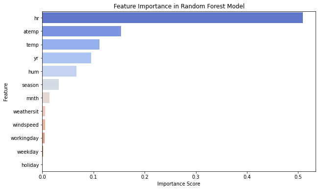
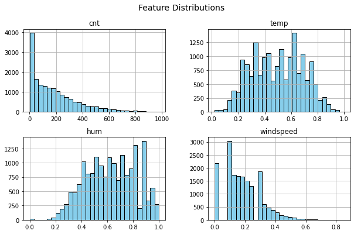
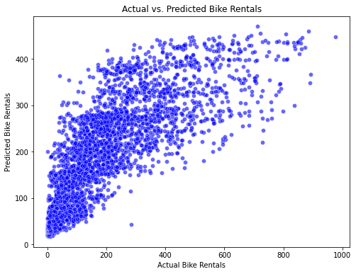

🚴‍♂️ Bike Sharing Analysis using Random Forest
Predicting Bike Rental Demand using Machine Learning in PySpark

📌 Project Overview
This project analyzes bike-sharing demand patterns using machine learning techniques.
We use a Random Forest Regressor to predict the number of bike rentals based on various factors, including:

✔ Weather conditions
✔ Time of day
✔ Seasonality
✔ Working days & holidays

By analyzing this data, we can identify trends and improve urban mobility planning. 🚴‍♂️📊

📂 Dataset Description
Dataset: Bike Sharing Dataset (UCI)
Files Used:
📄 hour.csv → Contains hourly bike rental data
📄 day.csv → Contains daily aggregated data

The dataset includes various features, such as:

Date & Time Information: dteday, hr, mnth, season, yr, weekday
Weather Conditions: temp, atemp, hum, windspeed, weathersit
Bike Rental Count: casual, registered, cnt (total count)
⚙ Technologies Used
Python (PySpark) for large-scale data processing
Apache Spark (Databricks) for distributed computing
Machine Learning: Random Forest Regressor
Visualization: Matplotlib, Seaborn
Big Data Processing with PySpark
🛠 Project Workflow
🔹 1. Data Preprocessing
✔ Loaded the dataset in PySpark
✔ Cleaned missing values and handled duplicates
✔ Performed feature selection

🔹 2. Feature Engineering
✔ Encoded categorical variables
✔ Scaled and normalized numerical features

🔹 3. Model Training
✔ Trained a Random Forest Regressor with optimized hyperparameters
✔ Used VectorAssembler for feature transformation

🔹 4. Model Evaluation
✔ Evaluated the model using RMSE & R² Score
✔ Analyzed Feature Importance

📊 Results & Model Performance
📌 Root Mean Squared Error (RMSE): 112.33
📌 R² Score: 0.61

🔥 Most Important Features:
1️⃣ hr (Hour) - Most significant factor affecting rentals
2️⃣ atemp (Feels-like Temperature) - Strong correlation with ridership
3️⃣ temp (Actual Temperature) - Direct impact on bike usage

📄 Model Evaluation Report: model_evaluation.txt

## 📊 Visualizations

### 🔹 Feature Importance Graph

### 🔹 Feature Correlation Matrix

### 🔹 Feature Distributions

### 🔹 Actual vs. Predicted Scatter Plot

🚀 How to Run the Project
1️⃣ Clone the Repository
bash
Copy
Edit
git clone https://github.com/pathakgovin/Bike-Sharing-Analysis.git
cd Bike-Sharing-Analysis
2️⃣ Run in Databricks or Jupyter Notebook
Open Databricks and import Bike_sharing_Data_Analysis.ipynb
If using Jupyter Notebook, install dependencies:
bash
Copy
Edit
pip install pyspark pandas matplotlib seaborn
Run the notebook step by step
📌 Key Insights & Implications
Peak rental hours: Evening and morning rush hours see the highest demand
Weather impact: High humidity & extreme temperatures lower bike rentals
Business Value: Optimizing bike availability at peak times improves customer experience
Urban Planning: Helps in infrastructure planning & sustainability 🚴‍♂️🌿
🏆 Contributions & Contact
🔹 Created by Govinda Pathak
🔗 [Connect on LinkedIn](https://www.linkedin.com/in/govinda-p-b61887268/)

🔹 Contributions & feedback are welcome! Feel free to fork and improve.
